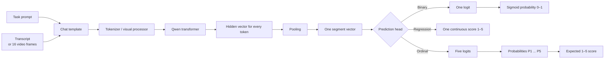
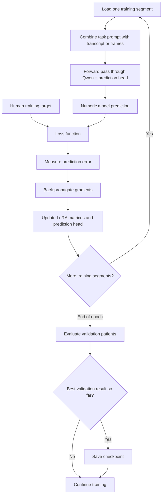
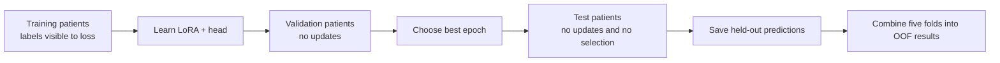

# WD_P presentation: complete slide-by-slide explanation

This document is a speaking guide and technical reference for the six WD_P slides. It explains what was measured, what entered each model, how the models were trained, how out-of-fold predictions were produced, and what can safely be concluded.

## The central distinction to keep throughout the presentation

There are two different prediction tasks. They answer different questions and use different evaluation metrics.

| Task | Question | Human target | Model output | Primary metric |
|---|---|---|---|---|
| Binary WD_P detection | Is withdrawal absent or present? | Rating `1` = negative; rating `>=2` = positive | Probability from 0 to 1 | Balanced accuracy |
| Ordinal/continuous WD_P severity | How salient is withdrawal on the 1–5 scale? | Mean of the two human ratings | Score from 1 to 5 | RMSE, MAE, Spearman, score range |

Binary performance around 0.61 does not mean the model reproduces human 1–5 ratings. It means the model has modest ability to distinguish the two sides of the `1` versus `>=2` boundary.

## Shared data and evaluation design

### Unit of analysis

Each row is one approximately one-minute psychotherapy segment. Each segment has:

- a stable segment identifier;
- patient and session identifiers;
- two independent human WD_P ratings on the 1–5 scale;
- a timestamped transcript with `T` and `P` speaker labels;
- a patient-side video representation consisting of 16 chronological frames.

### Human targets

For human ratings `r1` and `r2`:

- Continuous severity target: `WD_P_mean = (r1 + r2) / 2`.
- Per-rater binary label: `0` when the rating is `1`; `1` when the rating is `>=2`.
- Binary consensus-negative: both raters gave `1`.
- Binary consensus-positive: both raters gave `>=2`.
- Binary disagreement: one rater gave `1` and the other gave `>=2`.
- Soft binary target: `(I[r1>=2] + I[r2>=2]) / 2`, producing `0`, `0.5`, or `1`.

Binary consensus is not exact ordinal agreement. Ratings `2/4`, for example, are binary consensus-positive even though the ordinal ratings differ by two points.

### Five-fold patient-disjoint evaluation

The folds are patient-disjoint. A patient cannot occur in more than one of train, validation, and test within a fold.

For each outer fold:

1. Train on the assigned training patients.
2. Use different patients for validation and checkpoint selection.
3. Evaluate once on the held-out test patients.
4. Save every test prediction.
5. Combine the five test files into one out-of-fold, or OOF, table.

Across five folds, every included segment is evaluated when its patient is held out. This prevents the model from benefiting from seeing other minutes from the same patient during training.

### Why validation and test are separate

Validation data select the best epoch or checkpoint. Test data estimate generalization. Choosing a threshold or checkpoint from test performance would leak information and make the reported score optimistic.

## Shared model concepts

### QLoRA rather than full fine-tuning

Both model families were loaded in 4-bit NF4 form and adapted with LoRA. The pretrained weights remain quantized and mostly frozen. Small trainable low-rank matrices are inserted into transformer projection layers, and a small supervised prediction head is trained on top.

This reduces memory use enough to train an 8B or 14B model on a 32 GB GPU. It is still supervised fine-tuning: gradients update the LoRA parameters and the prediction head.

### These fine-tuned models are encoders with supervised heads

The principal fine-tuned experiments do not ask the model to generate a label as text. The pipeline is:

```text
transcript or video frames
        ↓
Qwen hidden states
        ↓
pool hidden states into one segment representation
        ↓
small supervised head
        ↓
binary probability or 1–5 severity score
```

The prompts guide the internal representation. The output head supplies the final numeric prediction.

### What the model receives for one training example

For the transcript model, one training example contains two pieces of input and one target that is kept separate from the input:

```text
SYSTEM PROMPT
"You are encoding a German psychotherapy transcript for WD_P ..."

TRANSCRIPT FOR ONE SEGMENT
"[00:01.2] T: ...
 [00:04.7] P: ..."

HUMAN TARGET — used to calculate loss, not shown inside the transcript
binary target: 0, 0.5, or 1
             OR
severity target: e.g. 2.5
             OR
ordinal distribution: e.g. [0, 0.5, 0.5, 0, 0]
```

The prompt tells Qwen what kind of evidence to represent. The transcript supplies the evidence for this particular segment. The human target tells the training algorithm how wrong the prediction was.

For the visual model, the transcript is replaced by 16 ordered patient frames:

```text
VISUAL PROMPT + FRAME 1 + FRAME 2 + ... + FRAME 16
                              ↓
                         human target
```

The human target is never appended to an evaluation transcript or passed to the model during held-out inference.

### Detailed model diagram



Qwen creates a hidden vector for each token position. Pooling reduces the sequence to one vector representing the whole segment:

- `mean_all` averages all valid hidden-token vectors;
- `last_token` uses the final valid token’s hidden vector;
- the VLM `mean_all` setting averages valid multimodal hidden states representing the images and prompt.

The resulting segment vector enters a small task-specific head. The head, rather than text generation, produces the numeric output.

### What LoRA changes inside Qwen

The large pretrained matrices remain frozen. For selected projection layers, LoRA learns a small correction:

```text
Original frozen transformation
            x ───────────────→ W x

Small trainable LoRA route
            x → A → B ───────→ B(Ax)

Combined layer output
            W x + scale × B(Ax)
```

`W` contains the original Qwen knowledge and is not directly updated. `A` and `B` are much smaller trainable matrices. The prediction head is also trainable. Four-bit quantization reduces the memory required to store `W`; BF16 is used for relevant computations.

### What happens during training



In plain language:

1. The model receives the same task instruction plus the first training transcript or frame sequence.
2. It produces a probability or score.
3. The loss function compares that prediction with the human target.
4. Back-propagation calculates how the trainable LoRA matrices and prediction head should change.
5. After the configured number of accumulated examples, the optimizer applies one update.
6. The next training segment uses the updated parameters and a different transcript or frame sequence.
7. The process continues through all shuffled training examples; one complete pass is an epoch.
8. At the end of an epoch, validation patients are predicted without weight updates.
9. The checkpoint with the best validation metric is retained.
10. Only after training and selection are finished is that checkpoint applied to held-out test patients.

The system prompt normally stays the same across examples within an experiment. The segment transcript or frame sequence and its human target change from example to example.

### Concrete binary training example

Assume both humans gave ratings above the binary boundary, so the target is `1`.

```text
Prompt + transcript
        ↓
Qwen + binary head
        ↓
raw logit = 0.405
        ↓ sigmoid
predicted probability = 0.60

human target = 1.00
binary-cross-entropy loss ≈ 0.51
        ↓
gradients adjust LoRA + head so similar evidence is more likely
to receive a higher probability in future
```

For a soft-label disagreement, the target is `0.5`. The model is trained to express uncertainty rather than being forced to call that row fully positive or negative.

At inference time, a probability such as `0.60` becomes positive because it is at least the fixed threshold `0.50`. The probability remains available for AUROC, AUPRC, Brier score, and calibration analyses.

### Concrete standard-regression example

Assume the humans rated a segment `2` and `3`, giving a mean target of `2.5`.

```text
Prompt + transcript
        ↓
Qwen + regression head
        ↓
predicted WD_P score = 1.8

human mean target = 2.5
error = 1.8 − 2.5 = −0.7
        ↓
Huber loss penalizes the error
        ↓
LoRA + regression head are updated
```

The standard regression model produces one number. During evaluation the LLM output is clipped to the permitted 1–5 interval. The VLM regression head uses `1 + 4 × sigmoid(raw)`, so its output is inherently between 1 and 5.

### Concrete ordinal example

Assume human 1 gives `2` and human 2 gives `3`. Instead of replacing the pair with the mean `2.5`, the ordinal model uses:

```text
soft target over scores 1, 2, 3, 4, 5
[0.0, 0.5, 0.5, 0.0, 0.0]
```

The model might predict:

```text
P(score=1) = 0.10
P(score=2) = 0.45
P(score=3) = 0.30
P(score=4) = 0.10
P(score=5) = 0.05
```

The five probabilities sum to 1. The continuous expected score is:

```text
1(0.10) + 2(0.45) + 3(0.30) + 4(0.10) + 5(0.05) = 2.55
```

Soft ordinal cross-entropy compares the five predicted probabilities with the two-rater target distribution. This teaches the model about both ratings and still provides a single expected 1–5 score for MAE and RMSE.

### Training, validation, and test are three different phases



| Phase | Human labels available to training code? | Are weights updated? | Purpose |
|---|---|---|---|
| Training | Yes | Yes | Learn LoRA parameters and head |
| Validation | Yes, for scoring only | No | Choose the best checkpoint |
| Test inference | Hidden from model; used afterward for metrics | No | Estimate held-out performance |

During test inference, the model receives only the prompt and transcript or frames. It outputs probabilities or scores. The evaluation script subsequently joins those predictions to the human labels and calculates the final metrics.

### Exact output produced by each experiment

| Experiment | Head output | Saved prediction | Final decision or score |
|---|---|---|---|
| Binary consensus | One logit | `WD_probability` | positive when probability `>=0.5` |
| Binary soft-label | One logit | `WD_probability` | evaluated as positive when probability `>=0.5` on consensus rows |
| Standard regression | One scalar | `WD_prediction` or `WD_P_pred` | continuous score from 1 to 5 |
| Ordinal | Five logits | five score probabilities plus `WD_prediction` | expected score `Σ score × probability` |
| Cumulative ordinal development run | Two monotonic logits | `P(WD>=2)` and `P(WD>=3)` | expected capped score `1 + P(WD>=2) + P(WD>=3)` |

### From individual predictions to reported results

After inference, the code does not report one result from one transcript. It aggregates all held-out predictions:

```text
Fold 1 held-out predictions ┐
Fold 2 held-out predictions ├─→ one OOF prediction table
Fold 3 held-out predictions ┤
Fold 4 held-out predictions ┤
Fold 5 held-out predictions ┘
                                  ↓
              compare every prediction with human targets
                                  ↓
        balanced accuracy / AUROC / MAE / RMSE / Spearman
```

For binary metrics, the probability is converted at 0.5 only when a hard label is required. AUROC and AUPRC use the continuous probabilities. For regression, the continuous score is compared with the mean human rating. Reliability analyses additionally compare the AI score separately with each human rater.

---

# Slide 1 — Same 16 patients: transcripts improved binary detection

## What this slide compares

This is the repaired 16-patient shared cohort, where both modalities use the same segments and patient folds.

- All severity regression rows: 2,457.
- Binary-consensus evaluation rows: 1,734.
- Video input: patient-only frames.
- Text input: timestamped therapist/patient transcript.

The binary values on this slide are the consensus fine-tuning comparison at a fixed probability threshold of 0.5:

- Qwen3-VL: balanced accuracy 0.574.
- Qwen3-8B transcript: balanced accuracy 0.621.

The regression values use all 2,457 rows:

- Qwen3-VL RMSE 0.695, predicted range 1.24–2.26.
- Qwen3-8B RMSE 0.710, predicted range 1.00–2.24.

## Confusion matrices underlying the binary slide

The common binary-consensus test set contains 1,014 positive and 720 negative segments. Both models use the fixed threshold `0.5`.

| Model | TN | FP | FN | TP | Accuracy | Sensitivity | Specificity | Precision | F1 | Balanced accuracy |
|---|---:|---:|---:|---:|---:|---:|---:|---:|---:|---:|
| Qwen3-VL video | 212 | 508 | 149 | 865 | 0.621 | 0.853 | 0.294 | 0.630 | 0.725 | **0.574** |
| Qwen3-8B transcript | 318 | 402 | 203 | 811 | 0.651 | 0.800 | 0.442 | 0.669 | 0.728 | **0.621** |

The VLM has greater sensitivity but labels many negative segments positive. The transcript model sacrifices some sensitivity while improving specificity by about 15 percentage points. Its balanced accuracy is therefore higher.

## Recommended spoken explanation

> I first compared text and video on exactly the same 16 patients and held-out folds. For the easier binary question—rating 1 versus rating 2 or higher—the transcript model had the higher balanced-accuracy point estimate, 0.621 versus 0.574. For full 1–5 severity, neither modality was clearly strong: RMSE was similar and both models compressed nearly all predictions into the low end of the scale.

Use “higher point estimate” rather than “clearly better.” The patient-cluster bootstrap interval for the binary balanced-accuracy difference included zero, so this experiment did not establish a stable patient-level modality advantage.

## LLM binary input

The Qwen3-8B input was a chat-formatted system instruction followed by the transcript. The saved `legacy_short_v1` system prompt was:

```text
You are encoding a German psychotherapy transcript for the 3RS v2022
Patient Moves Away (WD_P) construct. T denotes therapist and P denotes patient.
Attend to patient shutting down, avoiding therapeutic work, and masking experience.
Do not infer unavailable tone, facial behavior, posture, or pause duration.
```

The user content was the timestamped transcript, for example:

```text
[00:03.2] T: ...
[00:06.8] P: ...
```

The model was explicitly told that text contains no dependable posture, facial-expression, tone, or pause-duration evidence.

## LLM binary architecture and configuration

| Component | Setting |
|---|---|
| Backbone | `Qwen/Qwen3-8B` |
| Precision | 4-bit NF4 loading; BF16 computation |
| Adaptation | LoRA on attention and MLP projection layers |
| LoRA | rank 8, alpha 16, dropout 0.05 |
| Input limit | 2,048 tokens; overlength rows raise an error rather than being silently truncated |
| Pooling | mean of valid token hidden states |
| Prediction head | dropout 0.1 + one linear output |
| Objective | binary cross-entropy with logits |
| Epochs | 2 |
| Batch | 1, gradient accumulation 8; evaluation batch 2 |
| Learning rates | LoRA `5e-5`; head `1e-4` |
| Optimizer | AdamW, weight decay 0.01 |
| Scheduler | linear, 5% warm-up |
| Checkpoint selection | validation consensus AUPRC |
| Test decision | sigmoid probability `>=0.5` means WD_P positive |

The binary head produces one logit. A sigmoid transforms it into a probability. The threshold remains fixed at 0.5 for the cross-modality comparison.

## VLM binary input and architecture

Each segment was represented by 16 chronological frames sampled across the labelled minute. The pipeline used the resolved patient side, cropped the visible patient, resized frames to width 224, and loaded the saved frame cache.

The core visual prompt told the model to:

- focus only on the visible patient;
- represent patterns across the whole minute;
- preserve persistence, repetition, prominence, and change;
- treat rating `>=2` as the positive boundary;
- avoid inferring speech, motivation, diagnosis, or hidden emotion;
- use no audio or transcript.

| Component | Setting |
|---|---|
| Backbone | `Qwen/Qwen3-VL-8B-Instruct` |
| Visual input | 16 patient-only frames, width 224 |
| Precision | 4-bit model with BF16 visual computation |
| Adaptation | LoRA, rank 4, alpha 8, dropout 0.05 |
| Pooling | mean of all valid multimodal hidden states |
| Prediction head | layer norm → dropout → linear to 256 → GELU → dropout → one logit |
| Objective | binary cross-entropy with logits |
| Epochs | 1 |
| Gradient accumulation | 4 |
| Learning rates | LoRA `5e-5`; head `1e-4` |
| Checkpoint selection | validation AUPRC |
| Test decision | probability `>=0.5` means WD_P positive |

The 0.574 VLM result used `pos_weight=1`. This matters because the earlier automatic-weight run produced a different sensitivity/specificity balance.

## Binary training loop

For each fold and epoch:

1. Tokenize the transcript or assemble 16 frames plus the prompt.
2. Run the Qwen backbone and obtain hidden states.
3. Pool the hidden states into one vector per segment.
4. Pass the vector through the binary prediction head.
5. Compute binary cross-entropy against the human target.
6. Backpropagate through the head and LoRA parameters.
7. Accumulate gradients, clip them, and update with AdamW.
8. Evaluate on validation patients.
9. Retain the checkpoint with the best validation AUPRC.
10. Restore that checkpoint and predict the held-out test patients.

## Regression model on this slide

The target is the mean of the two human ratings. Both regression models use Smooth L1, or Huber, loss with beta 0.5. This behaves like squared error for small errors and absolute error for larger errors, reducing the influence of extreme mistakes.

The LLM regression head is a single linear output applied to the mean-pooled text representation. Predictions are clipped to 1–5 during evaluation. The VLM uses a larger head:

```text
pooled multimodal representation
→ layer norm
→ dropout
→ 256-unit linear layer
→ GELU
→ dropout
→ scalar
→ 1 + 4 × sigmoid(scalar)
```

The sigmoid transformation guarantees a VLM output between 1 and 5.

## How to interpret the metrics

- Balanced accuracy is the average of sensitivity and specificity. A model that predicts one class for every row receives approximately 0.50.
- RMSE is the square root of average squared error. It penalizes large misses more strongly than MAE.
- Predicted range reveals whether the model uses the available 1–5 scale.

The crucial regression finding is range compression. A reasonable average RMSE can coexist with failure to predict severe examples because low ratings dominate the data.

## What this slide does and does not show

Supported:

- Transcript binary detection had the higher point estimate on paired rows.
- Both modalities carried weak severity signal.
- Both severity outputs were strongly compressed.

Avoid saying:

- that transcript was proven superior at the patient-population level;
- that balanced accuracy 0.621 is human-level agreement;
- that the regression model learned ratings 4–5.

---

# Slide 2 — The dataset was small, so it was expanded

## What changed

| Cohort | Patients | Segments | Videos/sessions |
|---|---:|---:|---:|
| Repaired shared cohort | 16 | 2,457 | — |
| Expanded shared cohort | 20 | 4,325 | 89 |

The expanded cohort contains 2,753 Amberscript transcripts and 1,572 Voxtral transcripts. Every included segment is ready for both modalities: it has two ratings, usable transcript text, resolved patient-side video, and a successful 16-frame cache.

## Label distribution

For the 4,325 expanded rows:

- binary consensus: 3,026 rows, or 70.0%;
- binary disagreement: 1,299 rows, or 30.0%;
- exact 1–5 agreement: 2,283 rows, or 52.8%;
- mean WD_P `>=3`: 449 rows, or 10.38%;
- mean WD_P `>=4`: 15 rows, or 0.35%;
- both raters `>=4`: 13 rows;
- exact `5/5`: 0 rows.

## Recommended spoken explanation

> I expanded the common text-and-video cohort from 16 to 20 patients and from 2,457 to 4,325 segments. This gives much better coverage for binary detection. It does not solve the severity problem: only 449 segments have a mean rating of at least 3, only 15 reach a mean of at least 4, and there are no exact 5/5 examples.

## Why 4,325 rows are not equivalent to 4,325 independent people

The rows are repeated minutes from 20 patients. Adjacent segments from the same patient can be correlated. This is why:

- patients, rather than rows, define train/test separation;
- uncertainty should be resampled by patient;
- the effective diversity is closer to 20 independent patient trajectories than 4,325 unrelated observations.

## Why high-score scarcity drives collapse

With Huber, squared-error, or cross-entropy objectives, a model can reduce average loss by predicting values near the common low-score region. There are too few high-severity examples to impose a strong penalty for failing to represent ratings 4–5.

The problem is more severe within an individual fold. A fold’s training set contains only a fraction of the 15 mean-`>=4` examples. Some patient splits may have only a few such examples.

## Why the expanded cohort is still useful

It improves:

- patient diversity from 16 to 20;
- the number of held-out observations;
- transcript-provider coverage;
- the stability of binary evaluation;
- the ability to compare text and video on identical segments.

It does not make a five-level severity task well balanced.

## Likely question: “Why not oversample score 4–5 immediately?”

Oversampling repeats rare examples; it does not create new clinical variation. It may help the optimizer notice them, but it can also overfit the identities and wording of a handful of patients. Any oversampling or weighting must happen only within each training fold, and performance must be checked on genuinely held-out high-severity patients.

---

# Slide 3 — Expanded cohort: the same pattern remains

## Which experiments are shown

The binary numbers are the expanded **soft-label fine-tuning** results:

- VLM balanced accuracy: 0.596.
- LLM balanced accuracy: 0.612.

Soft-label training uses all 4,325 rows:

- both raters negative → target 0;
- raters disagree at the binary boundary → target 0.5;
- both raters positive → target 1.

The reported balanced accuracy is evaluated only on the 3,026 binary-consensus rows. The slide's VLM value uses a validation-selected threshold for each fold (`0.225`, `0.335`, `0.385`, `0.485`, or `0.560`), while the LLM value uses the fixed threshold `0.5`. Thus ambiguous rows contribute to training but not to the hard binary test score. Because the decision rules differ, the slide must disclose this threshold difference.

### Confusion matrices underlying the slide

The ground-truth consensus set contains 1,740 positive and 1,286 negative segments.

#### Qwen3-VL video — fold-specific validation-selected thresholds

| Human label / model decision | Predicted negative | Predicted positive | Total |
|---|---:|---:|---:|
| Human negative | **TN = 479** | **FP = 807** | 1,286 |
| Human positive | **FN = 313** | **TP = 1,427** | 1,740 |
| Total | 792 | 2,234 | 3,026 |

- Sensitivity/recall: `1,427 / 1,740 = 0.820`.
- Specificity: `479 / 1,286 = 0.372`.
- Precision: `1,427 / 2,234 = 0.639`.
- F1: `0.718`.
- Balanced accuracy: `(0.820 + 0.372) / 2 = 0.596`.
- Predicted-positive rate: `73.8%`.

The VLM finds most human-positive segments but also calls many human-negative segments positive.

#### Qwen3-8B transcript — fixed threshold 0.5

| Human label / model decision | Predicted negative | Predicted positive | Total |
|---|---:|---:|---:|
| Human negative | **TN = 742** | **FP = 544** | 1,286 |
| Human positive | **FN = 615** | **TP = 1,125** | 1,740 |
| Total | 1,357 | 1,669 | 3,026 |

- Sensitivity/recall: `1,125 / 1,740 = 0.647`.
- Specificity: `742 / 1,286 = 0.577`.
- Precision: `1,125 / 1,669 = 0.674`.
- F1: `0.660`.
- Balanced accuracy: `(0.647 + 0.577) / 2 = 0.612`.
- Predicted-positive rate: `55.2%`.

The transcript model misses more human-positive segments than the VLM, but it rejects substantially more human-negative segments correctly. Its sensitivity and specificity are more balanced.

#### Threshold sensitivity that should be kept in the technical notes

If the VLM is evaluated at the same fixed threshold of 0.5, its matrix becomes TN 774, FP 512, FN 570, and TP 1,170, giving balanced accuracy 0.637. This is higher than its slide value of 0.596 and higher than the LLM's 0.612. The headline modality ordering therefore depends on the selected decision rule. For a strict modality comparison, report either:

1. both models at the same prespecified threshold of 0.5; or
2. both models with thresholds selected independently using validation patients only.

Do not describe the slide's 0.596-versus-0.612 comparison as a pure model-quality difference without mentioning the different threshold procedures.

The regression comparison uses all 4,325 OOF rows:

- fold-specific training-mean baseline RMSE: 0.701;
- VLM RMSE: 0.699, range 1.18–2.90;
- LLM RMSE: 0.690, range 1.00–2.74.

## Recommended spoken explanation

> After expanding to 20 patients, the qualitative result stayed the same. Both modalities were above the 0.50 binary reference, and the transcript model had a slightly higher point estimate. For 1–5 severity, both learned models were only slightly better than a training-fold mean baseline. They used more range than before, but still rarely entered the clinically important high-score region.

Again, “slightly higher point estimate” is more accurate than “proved better.” For soft-label fine-tuning, the paired LLM-minus-VLM balanced-accuracy difference was 0.015 and its patient-bootstrap 95% interval was `[-0.038, 0.073]`.

## Expanded LLM soft-label configuration

The architecture and main hyperparameters match the slide-1 LLM binary model:

- Qwen3-8B, 4-bit NF4, BF16;
- LoRA rank 8, alpha 16;
- mean-all token pooling;
- one-logit binary head;
- 2 epochs;
- batch 1, accumulation 8;
- BCE with automatically calculated positive weight;
- best epoch chosen by validation consensus AUPRC.

Training counts vary because patient folds have different numbers of segments:

- train: 2,475–2,759 rows;
- validation: 747–1,103 rows;
- test: 747–1,026 rows.

## Expanded VLM soft-label configuration

- Qwen3-VL-8B-Instruct;
- 16 patient-only frames at width 224;
- 4-bit QLoRA, rank 4, alpha 8;
- mean-all multimodal pooling;
- nonlinear binary head;
- one epoch;
- gradient accumulation 4;
- automatically calculated positive weight;
- validation AUPRC checkpoint criterion.

## Expanded standard regression configuration

### Transcript model

- target: two-rater mean score;
- mean-all token pooling;
- scalar linear head;
- Huber loss, beta 0.5;
- 2 epochs;
- best epoch by validation MAE.

### Video model

- target: two-rater mean score;
- 16 patient-only frames;
- mean-all multimodal pooling;
- nonlinear bounded 1–5 head;
- Huber loss, beta 0.5;
- one epoch;
- best checkpoint by validation MAE.

## Why the mean baseline is important

For each fold, the baseline predicts the training-fold mean for every held-out segment. It has no transcript or video information. If a learned model barely improves on it, much of the low RMSE may come from the skewed label distribution rather than segment-specific understanding.

The improvements are small:

- LLM RMSE improvement: `0.701 − 0.690 = 0.011`.
- VLM RMSE improvement: `0.701 − 0.699 = 0.002`.

This is consistent with weak signal plus substantial shrinkage toward the average.

## Additional metrics that complete the story

| Model | MAE | RMSE | Spearman | Prediction SD |
|---|---:|---:|---:|---:|
| Training-mean baseline | 0.595 | 0.701 | −0.120 | 0.043 |
| Qwen3-8B standard regression | 0.551 | 0.690 | 0.210 | 0.265 |
| Qwen3-VL standard regression | 0.561 | 0.699 | 0.238 | 0.326 |

The VLM ranks segments slightly better by Spearman, while the LLM has lower MAE and RMSE. Neither has a prediction spread close to the human target spread.

## What this slide does and does not show

Supported:

- Both modalities contain segment-specific binary signal.
- Soft-label LLM has a modestly higher point estimate than soft-label VLM.
- Both regression models only slightly beat the fold-mean baseline by RMSE.
- Both remain range-compressed.

Avoid saying:

- that the LLM is significantly better than the VLM;
- that an RMSE of 0.690 means clinically reliable severity scoring;
- that additional rows solved the rare-label problem.

---

# Slide 4 — Above chance is still far from human rating behavior

## What exact and within-one agreement mean

- Exact agreement 52.8%: the two humans assigned exactly the same 1–5 score on 2,283 of 4,325 rows.
- Within-one agreement 91.2%: the two ratings differed by zero or one point.

These values show that severity is difficult even for humans, while also showing that most human disagreements are small.

## What the slide's ICC numbers mean

The three displayed values are reproducible. Human–human `ICC(A,1)` is `0.435`. Adding the standard-regression prediction as a third rater gives a three-rater ICC of `0.272` for Qwen3-VL and `0.264` for Qwen3-8B.

That slide comparison changes the number of raters from two to three. It is useful for asking whether the AI improves or weakens the reliability of the whole rating panel, but it is not a direct pairwise AI-versus-human comparison. For a like-for-like pairwise comparison, average AI-versus-rater-1 and AI-versus-rater-2:

| Expanded standard-regression comparison | Exact | Within 1 | AC2 (quadratic) | ICC(A,1) | Quadratic kappa |
|---|---:|---:|---:|---:|---:|
| Human rater 1 vs human rater 2 | **0.528** | **0.912** | **0.844** | **0.435** | **0.435** |
| Qwen3-VL vs human, mean of two pairs | 0.439 | 0.787 | 0.834 | 0.132 | 0.149 |
| Qwen3-8B vs human, mean of two pairs | 0.423 | 0.783 | 0.844 | 0.112 | 0.137 |

The human ICC and quadratic kappa happen to round to the same value here. They are different statistics; the equality is numerical coincidence for this dataset.

For the original three-rater slide formulation:

| Rating panel | Unanimous exact | Three-rater AC2 | Three-rater ICC(A,1) |
|---|---:|---:|---:|
| Human 1 + human 2 + Qwen3-VL | 0.256 | 0.837 | **0.272** |
| Human 1 + human 2 + Qwen3-8B | 0.239 | 0.844 | **0.264** |

## Recommended spoken explanation

> The two humans give exactly the same 1–5 rating on about 53% of segments and are within one point on 91%. Their absolute-agreement ICC is 0.435. When the AI is added as a third rater, panel ICC falls to 0.272 for video and 0.264 for transcript. In the stricter pairwise comparison, AI–human ICC is only 0.132 for video and 0.112 for transcript. AC2 stays near 0.84 because most ratings are low and quadratic weighting gives substantial credit to nearby low scores, so ICC, prediction range, and high-severity performance are more informative here.

## ICC, kappa, and AC2 in simple terms

### Exact agreement

This asks only whether two ratings are identical. It gives no credit to `2` versus `3`.

### Within-one agreement

This asks whether ratings differ by at most one. It is easy to obtain when nearly all scores are 1–3, so it must be shown with score distributions.

### Quadratic Cohen’s kappa

This is a chance-corrected pairwise agreement measure for ordinal ratings. A one-point miss receives less penalty than a three-point miss. It is suitable for comparing one AI with one human, then averaging the two AI-human comparisons.

### ICC(A,1)

This measures absolute agreement of numeric scores under a two-way random-effects, single-rating model. It penalizes systematic offsets and restricted score ranges. A model that tracks ordering but predicts only 1.5–2.0 can have poor ICC.

### Gwet AC2

AC2 is chance-corrected ordinal agreement and can use quadratic weights. In this skewed dataset it can be high when a model remains near the dominant low ratings. It should never be the only headline metric.

## Why AC2 can look misleading here

Suppose humans mostly choose 1 or 2, and a collapsed model predicts values near 1–2 for almost everyone. Quadratic weighting gives substantial partial credit to these close values. AC2 may therefore look good even though the model cannot rank cases well or predict severe withdrawal.

Read reliability alongside:

- MAE and RMSE;
- Spearman correlation;
- prediction standard deviation and range;
- performance by human rating band;
- exact and within-one agreement;
- confusion matrices for binary tasks.

## Why “AI as a third rater” needs care

Putting human 1, human 2, and AI in one three-rater coefficient changes the estimand. It no longer directly compares AI-human agreement with human-human agreement. Pairwise values on identical rows are easier to explain:

1. Calculate human1–human2.
2. Calculate AI–human1.
3. Calculate AI–human2.
4. Average the two AI-human values.
5. Bootstrap patients for uncertainty.

## What the results mean

The AI is learning some signal because:

- binary balanced accuracy is above the trivial 0.50 reference;
- regression Spearman correlations are positive;
- learned models improve modestly over constant baselines;
- swapping predictions between segments worsened earlier content-matching diagnostics.

The AI is not reproducing human severity behavior because:

- AI-human ordinal agreement is far below human-human agreement;
- prediction spread is much narrower than the human spread;
- high-severity segments are rarely predicted as high;
- improvements over constant regression baselines are small.

---

# Slide 5 — Increasing the LLM from 8B to 14B helped only a little

## What changed from standard regression

This experiment uses an ordinal classification objective rather than a single-output regression head.

For each segment, the two human ratings form a five-class soft target. Examples:

- ratings `1/1` → `[1, 0, 0, 0, 0]`;
- ratings `1/2` → `[0.5, 0.5, 0, 0, 0]`;
- ratings `2/4` → `[0, 0.5, 0, 0.5, 0]`.

The head emits five logits. Softmax converts them to probabilities for scores 1–5. The continuous prediction is the expected value:

```text
predicted score = 1×P(1) + 2×P(2) + 3×P(3) + 4×P(4) + 5×P(5)
```

This preserves both human opinions instead of reducing them immediately to their mean.

## Prompt used for 8B and 14B ordinal models

Both used `manual_compact_v2`. Its main operational content was:

- rate only observable patient movement away from the therapist or therapeutic work;
- consider shutting down, avoiding, and masking experience;
- use immediate therapist-patient turn context;
- do not automatically count short answers, stories, abstraction, topic changes, politeness, sadness, anxiety, or disagreement;
- require that behavior function as movement away;
- treat thoughtful on-topic responding and collaborative disagreement as counterevidence;
- judge salience using clarity, intensity, and frequency;
- use only supplied words and reliable speaker labels;
- do not infer visual behavior, tone, pause duration, diagnosis, or motivation.

The rubric anchors were:

```text
1 = no marker, or only one possible marker of very low clarity and intensity
2 = between 1 and 3
3 = at least one clear marker of moderate clarity or intensity
4 = between 3 and 5
5 = very clear or intense movement away, usually multiple markers or one
    dominant marker sustained through much of the segment
```

## Ordinal architecture and configuration

| Component | Qwen3-8B | Qwen3-14B |
|---|---:|---:|
| Backbone | `Qwen/Qwen3-8B` | `Qwen/Qwen3-14B` |
| Loading | 4-bit NF4, BF16 | 4-bit NF4, BF16 |
| LoRA | rank 8, alpha 16 | rank 8, alpha 16 |
| Pooling | last valid token | last valid token |
| Head | dropout + linear to 5 logits | same |
| Objective | soft ordinal cross-entropy | same |
| Epochs | 3 | 3 |
| Batch/eval batch | 1 / 2 | 1 / 1 |
| Learning rate | `3e-5` | `3e-5` |
| Head learning rate | `1e-4` | `1e-4` |
| Patient-balanced weighting | yes | yes |
| Checkpoint selection | lowest validation MAE | same |

Patient-balanced weighting gives each training patient approximately equal total influence despite different segment counts. It does not directly balance the five severity scores.

## Training loop for ordinal models

1. Convert the two ratings into a five-class probability distribution.
2. Encode the prompt and timestamped transcript.
3. take the final valid-token hidden state.
4. Produce five score logits.
5. Compute cross-entropy against the soft two-rater distribution.
6. Multiply each example by its patient-balancing weight.
7. Update LoRA and head parameters.
8. Convert validation probabilities to expected 1–5 scores.
9. Select the epoch with lowest validation MAE.
10. Predict held-out patients and aggregate five OOF folds.

## Results

| Model | MAE | RMSE | Spearman | Predicted range | Prediction SD |
|---|---:|---:|---:|---:|---:|
| Qwen3-8B ordinal | 0.557 | 0.690 | 0.171 | 1.02–2.39 | 0.233 |
| Qwen3-14B ordinal | 0.553 | **0.681** | **0.210** | 1.01–2.35 | 0.229 |

The 14B model reduces RMSE by 0.009, about 1.3% relative to the 8B RMSE. Its MAE improves by only 0.004. The prediction range becomes slightly narrower rather than wider.

## Recommended spoken explanation

> I doubled model size and used a more appropriate ordinal objective that preserved both rater scores. The 14B model reduced RMSE slightly and improved rank correlation, but its output still stayed almost entirely below 2.4. Capacity helped with some errors; it did not recover the missing high-severity range.

## Why a larger model did not solve collapse

- The training signal for ratings 4–5 remains extremely sparse.
- Cross-entropy is minimized efficiently by assigning probability to common low classes.
- Patient balancing corrects patient volume, not severity imbalance.
- Transcript content may omit visual, prosodic, and longer-term interactional evidence used by humans.
- The expected-value output can be conservative even when some probability is assigned to higher classes.

## What can safely be concluded

Supported:

- 14B has the best transcript RMSE among these ordinal runs.
- The gain is small.
- Model size alone does not fix severity collapse.

Avoid saying:

- that 14B is clinically meaningfully better;
- that 14B learned ratings 4–5;
- that the small numeric gain is necessarily stable across retraining seeds.

---

# Slide 6 — Next experiments: target the missing information

## Why focused development runs come before another five-fold suite

A full five-fold multimodal suite is expensive. Development should first use one frozen train/validation split, a fixed seed, and no test-set tuning. Promising changes can then move to three folds and finally all five folds.

The fast stage answers “is this idea promising?” The five-fold stage answers “does it generalize across held-out patients?”

## Priority 1: late fusion

### First experiment

Use the existing OOF or validation probabilities/scores from text and video:

```text
fused prediction = w × transcript prediction + (1 − w) × video prediction
```

Choose `w` on validation patients only. Evaluate the fixed weight on held-out patients.

For binary fusion, compare:

- text probability alone;
- video probability alone;
- simple average;
- validation-selected weighted average;
- logistic regression on the two probabilities.

For severity fusion, compare the same using continuous predictions and a ridge regression combiner.

### Why this is the first priority

It is cheap and directly tests complementarity. If video errors and transcript errors differ, fusion may improve performance even when video alone is weaker.

### Success criterion

Improvement must appear on held-out patients and should have a patient-bootstrap interval that is at least mostly above zero. Also inspect whether fusion improves specificity, high-score recall, and calibration rather than only one pooled metric.

## Priority 2: high-severity error analysis

Create a blinded review set containing:

- all mean WD_P `>=3` segments;
- all mean WD_P `>=4` segments;
- matched low-score controls from the same patients or sessions;
- human ratings, transcript provider, and model predictions;
- transcript, audio, subtitle file, and patient-side video.

Review:

- speaker-role errors;
- rating-window alignment;
- ASR omissions or mistranslations;
- whether the patient’s movement away depends on the therapist’s preceding intervention;
- whether humans appear to use prosody, posture, gaze, or longer temporal context;
- whether high ratings reflect persistence across adjacent minutes.

This is error analysis, not an opportunity to rewrite labels after seeing model errors. Corrections should follow a documented rule and be applied independently of model performance.

## Priority 3: imbalance-aware severity training

Test one change at a time:

1. Severity-stratified sampling within training patients.
2. Loss weights based on severity frequency.
3. A hybrid objective combining ordinal loss, MAE/Huber loss, and a ranking term.
4. Three-level targets such as `1`, `2`, and `>=3` if five levels remain unsupported.

Validation should report:

- overall MAE and RMSE;
- Spearman correlation;
- prediction SD and range;
- MAE by target band: `<2`, `2–<3`, and `>=3`;
- recall for mean score `>=3`;
- patient-level results.

Do not accept a method merely because it expands the prediction range. It must retain or improve overall error and rank ordering.

## Priority 4: temporal context

The current model treats every minute independently. A context model can receive:

- previous two or three segments;
- the target segment;
- explicit markers showing which segment is being rated.

The model should pool the target patient turns or use a target marker so that it does not predict the previous segment’s label.

Questions to test:

- Does context improve onset and escalation detection?
- Does it improve ratings `>=3`?
- Does it help only within the same session?
- Does it introduce leakage from overlapping windows or duplicated text?

## Suggested experimental order

1. Simple late fusion using saved predictions.
2. High-severity audit and data-quality corrections.
3. One-split severity-balanced ordinal training.
4. One-split temporal-context training.
5. Three-fold confirmation of promising variants.
6. Final five-fold patient-disjoint evaluation.

---

# Appendix A — Data flow diagrams

## Transcript binary classifier

```text
audio transcript
→ cleaning and role mapping
→ timestamped [time] T:/P: text
→ Qwen chat template with WD_P system prompt
→ Qwen3-8B hidden states
→ mean token pooling
→ one-logit classification head
→ sigmoid probability
→ fixed threshold 0.5
→ WD_P negative/positive
```

## Transcript severity regressor

```text
timestamped transcript + WD_P system prompt
→ Qwen3-8B hidden states
→ mean token pooling
→ scalar head
→ continuous prediction clipped to 1–5
→ compare with mean human rating
```

## Transcript ordinal model

```text
two ratings
→ soft five-class target

timestamped transcript + detailed manual prompt
→ Qwen3-8B or Qwen3-14B hidden states
→ last-token pooling
→ five logits
→ softmax probabilities for ratings 1–5
→ expected rating
```

## Video binary classifier

```text
one-minute video
→ resolved patient side
→ 16 chronological patient frames
→ visual WD_P prompt
→ Qwen3-VL hidden states
→ mean multimodal pooling
→ nonlinear binary head
→ sigmoid probability
→ fixed threshold 0.5
```

## Video severity regressor

```text
16 patient frames + severity prompt
→ Qwen3-VL hidden states
→ mean multimodal pooling
→ nonlinear bounded regression head
→ score from 1 to 5
```

# Appendix B — Metric glossary

| Metric | Meaning | Best value | Main limitation here |
|---|---|---:|---|
| Balanced accuracy | Mean of sensitivity and specificity | 1.0 | Does not measure ordinal severity |
| Precision | Fraction of predicted positives that are positive | 1.0 | Changes with prevalence |
| Recall/sensitivity | Fraction of positives found | 1.0 | Can be raised by overpredicting positive |
| Specificity | Fraction of negatives found | 1.0 | Can be raised by overpredicting negative |
| AUROC | Ranking positives above negatives across thresholds | 1.0 | May look acceptable despite poor calibration |
| AUPRC | Precision-recall summary across thresholds | 1.0 | Depends on positive prevalence |
| MAE | Mean absolute score error | 0 | A constant predictor can look competitive under skew |
| RMSE | Root mean squared score error | 0 | Dominated more by large errors |
| Spearman | Rank-order association | 1.0 | Does not require correct absolute values |
| Prediction SD/range | How much of the target scale is used | Match humans | Wide spread alone is not accuracy |
| Quadratic kappa | Pairwise chance-corrected ordinal agreement | 1.0 | Influenced by prevalence and weighting |
| ICC(A,1) | Absolute numeric agreement | 1.0 | Sensitive to range restriction and systematic bias |
| AC2 | Chance-corrected weighted agreement | 1.0 | Can appear optimistic with skew and nearby low scores |

# Appendix C — Answers to likely supervisor questions

## “Why balanced accuracy?”

The classes are not equally frequent. Ordinary accuracy can reward predicting the majority class. Balanced accuracy gives equal weight to the positive and negative recalls.

## “Why is 0.50 the chance reference?”

Balanced accuracy averages recall for each of two classes. A classifier that always predicts one class gets one recall of 1 and the other of 0, averaging to 0.5.

## “Why use a threshold of 2?”

The experiment operationalizes rating 1 as no salient withdrawal and ratings 2–5 as at least some withdrawal signal. This is a deliberately sensitive boundary. It does not mean rating 2 is a strong or clear rupture.

## “Why use soft labels?”

Soft labels retain binary rater disagreement. A `1/2` pair becomes 0.5 rather than being discarded or forced into one class. Evaluation remains on consensus rows so the hard binary outcome is unambiguous.

## “Why does zero-shot sometimes rival fine-tuning?”

The pretrained language model already contains linguistic knowledge relevant to avoidance and disengagement. Fine-tuning data are small at the patient level, noisy, and imbalanced. Fine-tuning may improve probability ranking or calibration without increasing balanced accuracy at exactly 0.5.

## “Why can RMSE improve while the model still collapses?”

Most labels are low. Predicting near the low mean avoids many large errors. The model can therefore lower average error while failing on the rare high-score cases.

## “Did 14B solve the problem?”

No. It reduced RMSE from 0.690 to 0.681, but its range remained 1.01–2.35. The model became slightly more accurate on average without learning the full severity scale.

## “Does text beat video?”

Text has higher binary point estimates in the paired comparisons. Patient-bootstrap intervals for the modality differences include zero. For continuous severity, advantages depend on the metric: the transcript model has lower error, while the expanded VLM has slightly higher Spearman correlation. The evidence supports complementary weak signals more strongly than a definitive winner.

## “Are the models human-level?”

No. Human exact agreement is 52.8% and within-one agreement is 91.2%, with human quadratic kappa 0.435. Mean AI-human quadratic kappas for expanded standard regression are only about 0.14.

## “What would count as real improvement?”

A stronger severity model should simultaneously:

- reduce MAE/RMSE on held-out patients;
- increase Spearman correlation;
- increase prediction spread toward the human spread;
- produce higher values for human-rated `>=3` segments;
- avoid degrading common low-score cases;
- replicate across patients and seeds.

# Appendix D — Source files for audit

- Experiment summary: `output/wd_expanded_completed_results_for_transfer/compiled_results.md`
- Repaired-cohort comparison: `docs/wd_vlm_llm_experiment_summary.md`
- Expanded cohort definition: `docs/wd_expanded_multimodal_cohort.md`
- LLM training implementation: `scripts/finetune_qwen3_8b_wd_text.py`
- VLM binary implementation: `scripts/finetune_qwen3vl_wd_consensus_binary.py`
- VLM severity implementation: `scripts/finetune_qwen3vl_wd_only_large.py`
- Expanded cohort counts: `output/wd_expanded_cohort_overview/summary.json`
- Label scarcity counts: `output/wd_expanded_label_distribution/summary.json`
- Saved run configurations: `output/wd_expanded_completed_results_for_transfer/*/fold_1/run_config.json`
